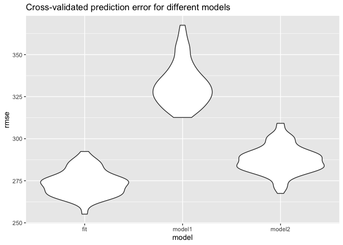

Homework 6
================
Jiarui Fu
11/20/2019

## Problem 1

``` r
birthweight = read.csv("data/birthweight.csv") 
birthweight_clean = birthweight %>%  
  select(-parity, -pnumlbw, -pnumsga) %>%
  mutate(babysex = factor(babysex),
         frace = factor(frace),
         malform = factor(malform),
         mrace = factor(mrace)) %>% 
  mutate(babysex = fct_infreq(babysex),
         frace = fct_infreq(frace),
         malform = fct_infreq(malform),
         mrace = fct_infreq(mrace)) %>% 
  mutate(babysex = recode(babysex, "1" = "male", "2" = "female"),
         frace = recode(frace, "1" = "White", "2" = "Black", "3" = "Asian", "4" = "Puerto Rican", "8" = "Other", "9" = "Unknown"),
         malform = recode(malform, "0" = "absent", "1" = "present"),
         mrace = recode(mrace, "1" = "White", "2" = "Black", "3" = "Asian", "4" = "Puerto Rican", "8" = "Other"))

fit0 = lm(bwt ~ ., data = birthweight_clean)
summary(fit0)
```

    ## 
    ## Call:
    ## lm(formula = bwt ~ ., data = birthweight_clean)
    ## 
    ## Residuals:
    ##      Min       1Q   Median       3Q      Max 
    ## -1096.00  -184.96    -3.85   173.23  2341.81 
    ## 
    ## Coefficients: (1 not defined because of singularities)
    ##                     Estimate Std. Error t value Pr(>|t|)    
    ## (Intercept)       -6234.7918   660.6229  -9.438  < 2e-16 ***
    ## babysexfemale        29.3004     8.4660   3.461 0.000543 ***
    ## bhead               130.9309     3.4535  37.912  < 2e-16 ***
    ## blength              74.8920     2.0226  37.028  < 2e-16 ***
    ## delwt                 4.1285     0.3949  10.456  < 2e-16 ***
    ## fincome               0.2749     0.1795   1.531 0.125786    
    ## fraceBlack           14.3421    46.1745   0.311 0.756115    
    ## fracePuerto Rican   -47.3625    44.7016  -1.060 0.289420    
    ## fraceAsian           20.5951    69.3321   0.297 0.766442    
    ## fraceOther            4.1488    74.1132   0.056 0.955361    
    ## gaweeks              11.2660     1.4612   7.710 1.55e-14 ***
    ## malformpresent        9.0355    70.6626   0.128 0.898259    
    ## menarche             -3.5036     2.8965  -1.210 0.226509    
    ## mheight               9.3832    10.3156   0.910 0.363077    
    ## momage                0.9706     1.2195   0.796 0.426114    
    ## mraceBlack         -151.3217    46.0697  -3.285 0.001029 ** 
    ## mracePuerto Rican   -56.6890    45.1607  -1.255 0.209447    
    ## mraceAsian          -92.2202    71.9561  -1.282 0.200046    
    ## ppbmi                 3.8297    14.8975   0.257 0.797138    
    ## ppwt                 -3.4136     2.6134  -1.306 0.191554    
    ## smoken               -4.8598     0.5874  -8.274  < 2e-16 ***
    ## wtgain                    NA         NA      NA       NA    
    ## ---
    ## Signif. codes:  0 '***' 0.001 '**' 0.01 '*' 0.05 '.' 0.1 ' ' 1
    ## 
    ## Residual standard error: 272.6 on 4321 degrees of freedom
    ## Multiple R-squared:  0.718,  Adjusted R-squared:  0.7167 
    ## F-statistic:   550 on 20 and 4321 DF,  p-value: < 2.2e-16

``` r
birthweight_fit = birthweight_clean %>% 
  select(babysex, bhead, blength, bwt, gaweeks, mrace, smoken, wtgain) 

fit = lm(bwt ~ babysex + gaweeks + bhead * mrace + blength * smoken + wtgain, data = birthweight_fit)
summary(fit)
```

    ## 
    ## Call:
    ## lm(formula = bwt ~ babysex + gaweeks + bhead * mrace + blength * 
    ##     smoken + wtgain, data = birthweight_fit)
    ## 
    ## Residuals:
    ##      Min       1Q   Median       3Q      Max 
    ## -1071.38  -184.74    -3.96   179.80  2340.12 
    ## 
    ## Coefficients:
    ##                           Estimate Std. Error t value Pr(>|t|)    
    ## (Intercept)             -6029.5058   164.4306 -36.669  < 2e-16 ***
    ## babysexfemale              33.2116     8.5017   3.906 9.51e-05 ***
    ## gaweeks                    11.5593     1.4660   7.885 3.95e-15 ***
    ## bhead                     147.5640     4.7019  31.384  < 2e-16 ***
    ## mraceBlack                607.9486   189.8610   3.202 0.001374 ** 
    ## mracePuerto Rican        1157.1275   390.5295   2.963 0.003063 ** 
    ## mraceAsian               3520.2834  1174.0677   2.998 0.002730 ** 
    ## blength                    74.4947     2.1740  34.266  < 2e-16 ***
    ## smoken                    -39.5518    10.8713  -3.638 0.000278 ***
    ## wtgain                      3.8669     0.3906   9.901  < 2e-16 ***
    ## bhead:mraceBlack          -22.2828     5.6233  -3.963 7.53e-05 ***
    ## bhead:mracePuerto Rican   -38.1347    11.5295  -3.308 0.000949 ***
    ## bhead:mraceAsian         -107.1502    34.6025  -3.097 0.001970 ** 
    ## blength:smoken              0.7122     0.2191   3.250 0.001162 ** 
    ## ---
    ## Signif. codes:  0 '***' 0.001 '**' 0.01 '*' 0.05 '.' 0.1 ' ' 1
    ## 
    ## Residual standard error: 273.8 on 4328 degrees of freedom
    ## Multiple R-squared:  0.715,  Adjusted R-squared:  0.7141 
    ## F-statistic:   835 on 13 and 4328 DF,  p-value: < 2.2e-16

``` r
birthweight_clean %>% 
  modelr::add_residuals(fit) %>% 
  modelr::add_predictions(fit) %>% 
  ggplot(aes(x = pred, y = resid)) + geom_point() 
```

<!-- -->

``` r
model1 = lm(bwt ~ blength + gaweeks, data = birthweight_fit)
summary(model1)
```

    ## 
    ## Call:
    ## lm(formula = bwt ~ blength + gaweeks, data = birthweight_fit)
    ## 
    ## Residuals:
    ##     Min      1Q  Median      3Q     Max 
    ## -1709.6  -215.4   -11.4   208.2  4188.8 
    ## 
    ## Coefficients:
    ##              Estimate Std. Error t value Pr(>|t|)    
    ## (Intercept) -4347.667     97.958  -44.38   <2e-16 ***
    ## blength       128.556      1.990   64.60   <2e-16 ***
    ## gaweeks        27.047      1.718   15.74   <2e-16 ***
    ## ---
    ## Signif. codes:  0 '***' 0.001 '**' 0.01 '*' 0.05 '.' 0.1 ' ' 1
    ## 
    ## Residual standard error: 333.2 on 4339 degrees of freedom
    ## Multiple R-squared:  0.5769, Adjusted R-squared:  0.5767 
    ## F-statistic:  2958 on 2 and 4339 DF,  p-value: < 2.2e-16

``` r
model2 = lm(bwt ~ bhead * blength * babysex, data = birthweight_fit)
summary(model2)
```

    ## 
    ## Call:
    ## lm(formula = bwt ~ bhead * blength * babysex, data = birthweight_fit)
    ## 
    ## Residuals:
    ##      Min       1Q   Median       3Q      Max 
    ## -1132.99  -190.42   -10.33   178.63  2617.96 
    ## 
    ## Coefficients:
    ##                               Estimate Std. Error t value Pr(>|t|)    
    ## (Intercept)                 -7176.8170  1264.8397  -5.674 1.49e-08 ***
    ## bhead                         181.7956    38.0542   4.777 1.84e-06 ***
    ## blength                       102.1269    26.2118   3.896 9.92e-05 ***
    ## babysexfemale                6374.8684  1677.7669   3.800 0.000147 ***
    ## bhead:blength                  -0.5536     0.7802  -0.710 0.478012    
    ## bhead:babysexfemale          -198.3932    51.0917  -3.883 0.000105 ***
    ## blength:babysexfemale        -123.7729    35.1185  -3.524 0.000429 ***
    ## bhead:blength:babysexfemale     3.8781     1.0566   3.670 0.000245 ***
    ## ---
    ## Signif. codes:  0 '***' 0.001 '**' 0.01 '*' 0.05 '.' 0.1 ' ' 1
    ## 
    ## Residual standard error: 287.7 on 4334 degrees of freedom
    ## Multiple R-squared:  0.6849, Adjusted R-squared:  0.6844 
    ## F-statistic:  1346 on 7 and 4334 DF,  p-value: < 2.2e-16

``` r
cv_df = crossv_mc(birthweight_fit, 100)
cv_df = 
  cv_df %>% 
  mutate(fit = map(train, ~lm(bwt ~ babysex + gaweeks + bhead * mrace + blength * smoken + wtgain, data = birthweight_fit)),
         model1 = map(train, ~lm(bwt ~ blength + gaweeks, data = birthweight_fit)),
         model2 = map(train, ~lm(bwt ~ bhead * blength * babysex, data = birthweight_fit))) %>% 
  mutate(rmse_fit = map2_dbl(fit, test, ~rmse(model = .x, data = .y)),
         rmse_model1 = map2_dbl(model1, test, ~rmse(model = .x, data = .y)),
         rmse_model2 = map2_dbl(model2, test, ~rmse(model = .x, data = .y)))

cv_df %>% 
  select(starts_with("rmse")) %>% 
  pivot_longer(
    everything(),
    names_to = "model", 
    values_to = "rmse",
    names_prefix = "rmse_") %>% 
  mutate(model = fct_inorder(model)) %>% 
  ggplot(aes(x = model, y = rmse)) + geom_violin()
```

<!-- -->

## Problem 2

``` r
weather_df = 
  rnoaa::meteo_pull_monitors(
    c("USW00094728"),
    var = c("PRCP", "TMIN", "TMAX"), 
    date_min = "2017-01-01",
    date_max = "2017-12-31") %>%
  mutate(
    name = recode(id, USW00094728 = "CentralPark_NY"),
    tmin = tmin / 10,
    tmax = tmax / 10) %>%
  select(name, id, everything())
```

    ## Registered S3 method overwritten by 'crul':
    ##   method                 from
    ##   as.character.form_file httr

    ## Registered S3 method overwritten by 'hoardr':
    ##   method           from
    ##   print.cache_info httr

    ## file path:          /Users/JiaruiFu/Library/Caches/rnoaa/ghcnd/USW00094728.dly

    ## file last updated:  2019-11-20 14:16:14

    ## file min/max dates: 1869-01-01 / 2019-11-30

``` r
bootstrap_regression = 
weather_df %>% 
  modelr::bootstrap(n = 5000) %>% 
  mutate(
    models = map(strap, ~lm(tmax ~ tmin, data = .x) ),
    tidied = map(models, broom::tidy),
    glanced = map(models, glance)) %>% 
  select(-strap, -models) 

bootstrap_beta = 
  bootstrap_regression %>% 
  select(-glanced) %>% 
  unnest(tidied) 


bootstrap_rsq = 
  bootstrap_regression %>% 
  select(-tidied) %>% 
  unnest(glanced)
```
